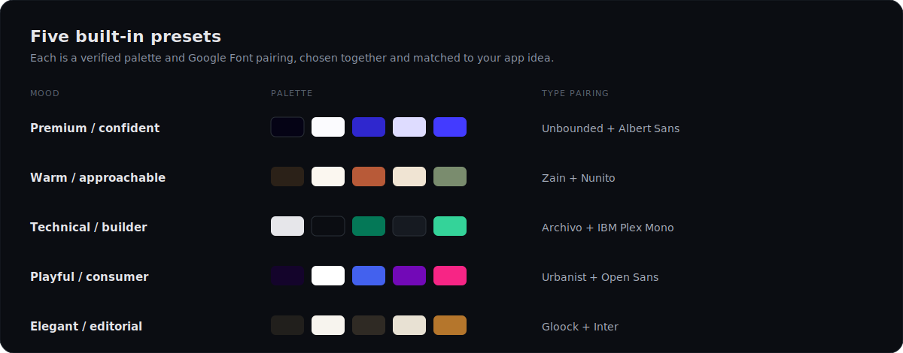

<div align="center">
  

  <p>
    <a href="LICENSE"></a>
    <a href="https://github.com/codeswithroh/tastemaker/stargazers"></a>
    <a href="CONTRIBUTING.md"></a>
    
    <a href="https://tastemaker-ai-skill.netlify.app"></a>
  </p>

  <p><b>A skill that gives AI real design taste, so the UI it builds does not look AI-generated.</b></p>

  <p>
    <a href="#quick-start">Quick start</a> &nbsp;·&nbsp;
    <a href="#why-ai-ui-all-looks-the-same">Why</a> &nbsp;·&nbsp;
    <a href="#what-you-get">Features</a> &nbsp;·&nbsp;
    <a href="#the-five-presets">Presets</a> &nbsp;·&nbsp;
    <a href="#how-it-works">How it works</a> &nbsp;·&nbsp;
    <a href="#contributing">Contributing</a>
  </p>

  <p><a href="https://tastemaker-ai-skill.netlify.app"><b>See it live and try the demo &rarr;</b></a></p>
</div>

<br>

## What this is

Tastemaker is a skill for coding agents (Claude Code, Cursor, Windsurf). You install it once and forget it. Whenever you ask your agent to build or style a UI, tastemaker steps in and gives it a real design system to work from, instead of the generic defaults every model reaches for.

It is plain Markdown and small Python scripts. Everything runs on your machine. There is no hosted backend, no account, and no API key.

## Why AI UI all looks the same

Ask any model to build a UI and you tend to get the same thing: an indigo to purple gradient, a soft shadow card, a generic hero. This is not a prompting problem. It happens because the model has to invent taste from a text description, with nothing real to ground it and no memory of what you actually like.

Tastemaker fixes this with three ideas, not a bigger pile of presets:

1. **Ground in real pixels, not words.** Give it a screenshot or a reference and it reads the real colors and contrast from the actual image, using a script. It does not write a vague summary of the vibe and rebuild from that. Text summaries lose most of what made the reference feel specific.
2. **Remember, do not re-derive.** Once a project locks a style, every later screen reuses it. Nothing drifts. Across projects, a small profile file learns what you keep and what you reject, so your next project starts warm.
3. **Scope to the real work.** It reads your spec first and figures out which screens actually need design, instead of dumping a design system that has nothing to do with what you are shipping.

## Quick start

Install it into your Claude Code skills folder:

```bash
git clone https://github.com/codeswithroh/tastemaker ~/.claude/skills/tastemaker
```

Restart Claude Code, then just ask:

```
build a landing page for a coffee subscription
```

Tastemaker triggers on its own. It picks a palette and type pairing, sources real assets, wires up motion, and builds. You do not invoke anything.

> Using Cursor or Windsurf? Drop the same folder into their skills directory.

For the deterministic color extraction script you need Python 3 and Pillow (`pip install Pillow`). If Pillow is missing, it falls back to a vision based read instead of failing.

## What you get

| | |
|---|---|
| **Grounded in real pixels** | Reference images become real color tokens through `scripts/extract_palette.py`, not a text guess. |
| **Auto matched palette and type** | Five mood presets, each a verified palette and font pairing chosen together. No color picker to fill in. |
| **Contrast that is checked, not eyeballed** | `scripts/check_contrast.py` catches the button label failure a swatch preview hides. Two presets failed this on the first pass and were fixed. |
| **Real illustrations** | Each concept is matched to real illustrator grade art and recolored to your palette, not drawn from scratch by the model. |
| **A real logo, not a letter in a box** | A constructed geometric mark plus a full favicon set, readable down to 16px. |
| **Motion by default** | GSAP and ScrollTrigger reveals plus a sequenced hero, wired during the build and not left as a follow up. |
| **Attribution free assets** | Photos (Openverse), icons (Iconify), and illustrations all need no keys and no visible credit line. |
| **Taste that compounds** | A local profile remembers what you keep across projects, so the tool gets more accurate the more you use it. |

## The five presets

When you have no reference to work from, tastemaker reads your app idea and picks a matched set. It never asks you to fill in a color form.

<div align="center">
  
</div>

Each palette is checked for WCAG AA contrast on both body text and button labels before it ships. Every font is a Google Font, so there is no licensing question.

## How it works

```
1. Read the idea      references, or the app concept itself
2. Lock the style     palette and type, contrast checked, written to a lock file
3. Source assets      photos, illustrations, icons, logo, favicons, in one pass
4. Build the screens  visual first, motion wired in, checked against an anti-slop list
5. Remember taste     what you keep rolls into a profile for the next project
```

The full workflow lives in [`SKILL.md`](SKILL.md). The reference files in [`references/`](references/) hold the deep material and are read only when a step needs them.

## Read the story

I wrote up why I built this and how it works:

**[Every AI built site looks the same, so I built a skill that locks taste before any code is written](https://dev.to/codeswithroh/every-ai-built-site-looks-the-same-so-i-built-a-skill-that-locks-taste-before-any-code-is-written-4f6d)**

## Project layout

```
tastemaker/
├── SKILL.md                     the workflow, read this first
├── references/                  palettes, patterns, motion, asset sourcing, checklists
├── scripts/                     palette extraction, contrast check, asset fetch, recolor
├── assets/                      GSAP motion starter and a dependency free fallback
└── site/                        the marketing site and live demo
```

## Contributing

Contributions are very welcome. Bug reports, new presets, better docs, and new patterns all help.

Please read [CONTRIBUTING.md](CONTRIBUTING.md) before you start, and see the [Code of Conduct](CODE_OF_CONDUCT.md). Good first issues are labeled [`good first issue`](https://github.com/codeswithroh/tastemaker/labels/good%20first%20issue).

If tastemaker saved you from one more indigo gradient, a star helps other builders find it.

## License

[MIT](LICENSE). Use it freely, including in commercial work.
