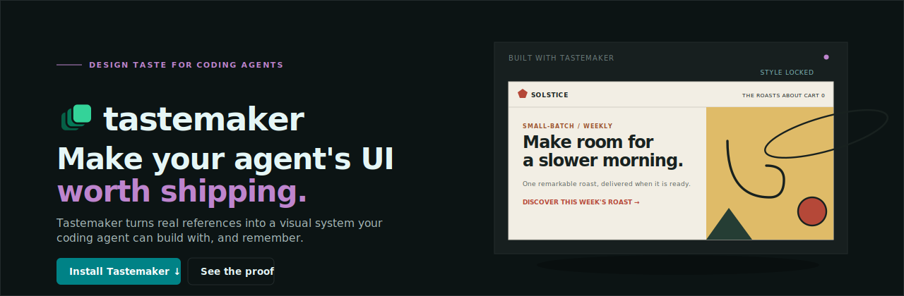
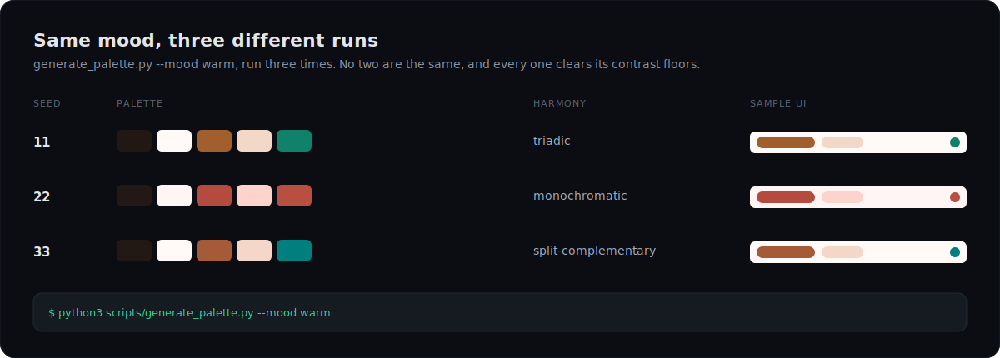

<div align="center">
  

  <p>
    <a href="LICENSE"></a>
    <a href="https://github.com/codeswithroh/tastemaker/stargazers"></a>
    <a href="CONTRIBUTING.md"></a>
    
    <a href="https://tastemaker-ai-skill.netlify.app"></a>
  </p>

  <p><b>A skill that gives AI real design taste, so the UI it builds does not look AI-generated.</b></p>

  <p>
    <a href="#quick-start">Quick start</a> &nbsp;·&nbsp;
    <a href="#why-ai-ui-all-looks-the-same">Why</a> &nbsp;·&nbsp;
    <a href="#can-i-not-just-tell-the-ai-to-write-the-decisions-down">Why not just prompt it?</a> &nbsp;·&nbsp;
    <a href="#what-is-verified-and-what-is-judgment">What is verified</a> &nbsp;·&nbsp;
    <a href="#what-you-get">Features</a> &nbsp;·&nbsp;
    <a href="#the-palette-generator">Palette generator</a> &nbsp;·&nbsp;
    <a href="#contributing">Contributing</a>
  </p>

  <p><a href="https://tastemaker-ai-skill.netlify.app"><b>See it live and try the demo &rarr;</b></a></p>
</div>

<br>

## What this is

Tastemaker is a skill for coding agents (Claude Code, Cursor, Windsurf). You install it once and forget it. Whenever you ask your agent to build or style a UI, tastemaker steps in and gives it a real design system to work from, instead of the generic defaults every model reaches for.

It is plain Markdown and small Python scripts. Everything runs on your machine. There is no hosted backend, no account, and no API key.

## Why AI UI all looks the same

Ask any model to build a UI and you tend to get the same thing: an indigo to purple gradient, a soft shadow card, a generic hero. This is not a prompting problem. It happens because the model has to invent taste from a text description, with nothing real to ground it and no memory of what you actually like.

Tastemaker fixes this with four ideas, not a bigger pile of presets:

1. **Generate within a check that actually runs.** The palette is not one of five fixed presets, and it is not five approved colors the model may combine however it likes. It is generated per project (a fresh hue and harmony each time) against a contract: `check_contrast.py --matrix` computes every pairing and says which may carry text, which may carry a border, and which may carry neither. So the constraint produces variety instead of sameness, and a rule that runs is different in kind from a rule you wrote down, because it returns the same answer no matter how confident anyone felt.
2. **Ground in real pixels, not words.** Give it a screenshot or a reference and it reads the real colors and contrast from the actual image, using a script. It does not write a vague summary of the vibe and rebuild from that. Text summaries lose most of what made the reference feel specific.
3. **Remember, do not re-derive.** Once a project locks a style, every later screen reuses it. Nothing drifts. Across projects, a small profile file learns what you keep and what you reject, so your next project starts warm.
4. **Scope to the real work.** It reads your spec first and figures out which screens actually need design, instead of dumping a design system that has nothing to do with what you are shipping.

## "Can I not just tell the AI to write the decisions down?"

Yes, partly, and it is worth being straight about where the line is.

If you say *"lock these decisions as a design bible and use it as our anchor,"* you get the decisions written down in the current context. For keeping three screens consistent inside one chat, that genuinely works, and you do not need this skill for it.

Here is what that does not give you:

- **It does not survive the session.** The bible lives in context. Close the chat and it is gone, or you re-paste it and hope. Tastemaker writes `.tastemaker/style-lock.md` to your repo and `~/.tastemaker/profile.md` to your home directory, so the decision outlives the conversation and carries into the next project.
- **It has no check that runs.** A written-down preference is still a judgment you can talk yourself out of. `check_contrast.py --matrix` is a computation. It does not care how good the palette looked to you, and it returns the same verdict every time. That is the difference between an intention and a constraint.
- **It cannot read pixels.** "Match this reference" through a conversation becomes a text description of an image, then a rebuild from the description. `extract_palette.py` reads the actual pixel values.
- **It leaves the combinations to improvisation.** A written bible lists your colors. It does not enumerate which of those colors may legally touch which, so the model still guesses when it invents a badge fill or a disabled state. The matrix answers that up front.

Short version: a conversation gives you the decision. This gives you the decision plus something that enforces it after you have stopped paying attention.

## What is verified, and what is judgment

Worth separating these two clearly, because it is easy to let one stand in for the other, and this project has been guilty of that.

**Verified (a computation, not taste).** Contrast and readability. `check_contrast.py` runs real WCAG math over the palette and reports pass or fail. This is accessibility, not aesthetics. A palette that clears every ratio can still be ugly. The reason it belongs here anyway is that it catches a class of failure your eyes genuinely cannot: contrast is a calculation, and looking at a color confidently is not running it. Early hand-picked palette drafts for two moods failed that check on the first pass, and only the script caught it. That failure is the reason color is generated against the contract now instead of hand-tuned and hoped.

**Judgment (heuristics and memory, not proof).** Everything that is actually taste: the reference extraction, the mood-to-palette matching, the accumulated profile, and the anti-slop checklist. These are informed defaults and accumulated preference. They are not verified, and this README should not imply they are. They get better with your references and your rejections, not with more math.

Do not read the contrast script as evidence that the design is good. Read it as evidence that the design is legible, which is a smaller and more checkable claim.

## Quick start

Install it into your Claude Code skills folder:

```bash
git clone https://github.com/codeswithroh/tastemaker ~/.claude/skills/tastemaker
```

Restart Claude Code, then just ask:

```
build a landing page for a coffee subscription
```

Tastemaker triggers on its own. It generates a palette, picks a matching type pairing, sources real assets, wires up motion, and builds. You do not invoke anything.

> Using Cursor or Windsurf? Drop the same folder into their skills directory.

For the deterministic color extraction script you need Python 3 and Pillow (`pip install Pillow`). If Pillow is missing, it falls back to a vision based read instead of failing.

## What you get

| | |
|---|---|
| **Grounded in real pixels** | Reference images become real color tokens through `scripts/extract_palette.py`, not a text guess. |
| **A fresh palette every time, not one of five** | `generate_palette.py` builds a new palette per project: a base hue in the mood's range, a color-harmony rule for the accent, and per-role lightness solved so the contrast pairings clear their floors. Two similar prompts get two different, legible palettes instead of the same preset. |
| **A contrast contract, not a one time check** | `check_contrast.py --matrix` computes every pairing in the palette and reports which may carry text, which may carry a border, and which may carry neither. The generator satisfies this by construction, so a fresh palette is still a legible one. This buys readability, not taste. |
| **Real illustrations** | Each concept is matched to real illustrator grade art and recolored to your palette, not drawn from scratch by the model. |
| **A real logo, not a letter in a box** | A constructed geometric mark plus a full favicon set, readable down to 16px. |
| **Motion by default** | GSAP and ScrollTrigger reveals plus a sequenced hero, wired during the build and not left as a follow up. |
| **Attribution free assets** | Photos (Openverse), icons (Iconify), and illustrations all need no keys and no visible credit line. |
| **Taste that compounds** | A local profile remembers what you keep across projects, so the tool gets more accurate the more you use it. |

## The palette generator

When you have no reference, tastemaker does not hand you a color picker, and it does not pick from a shelf of preset palettes either. **It generates one, on the spot, for your project.** A shelf of five presets is still a shelf: install the skill twice for two different products and you would get the same five outcomes. That is a smaller monoculture, not a solved one.

Instead, `scripts/generate_palette.py` classifies your app idea into a mood (premium, warm, technical, playful, or elegant, by keyword), then builds a genuinely new palette for it every run:

- A **base hue** chosen at random within the mood's hue range.
- A **color-harmony rule** for the accent: analogous, complementary, triadic, split-complementary, or monochromatic.
- Every role's **lightness solved against the contrast contract**, in OKLCH, so text, button labels, and accents clear their WCAG floors by construction, not by hand-tuning after the fact. This is the same target-ratio idea behind Adobe Leonardo's color engine.

The proof is that the same mood produces different, and equally legible, output every time:

<div align="center">
  
</div>

Run it yourself:

```bash
python3 scripts/generate_palette.py --mood technical
```

It prints the roles as hex, a live preview link, and the full contrast matrix, which pairing may carry text, which may only carry a border, and which is decorative, ready to paste straight into `.tastemaker/style-lock.md`. Pass `--seed <n>` to reproduce an exact result; omit it and every run is new. Fonts stay curated per mood (a real Google Font pairing, chosen for the mood's character, so there is no licensing question); only the color is generated.

## How it works

```
1. Read the idea      references, or the app concept itself
2. Lock the style     palette and type, contrast checked, written to a lock file
3. Source assets      photos, illustrations, icons, logo, favicons, in one pass
4. Build the screens  visual first, motion wired in, checked against an anti-slop list
5. Remember taste     what you keep rolls into a profile for the next project
```

The full workflow lives in [`SKILL.md`](SKILL.md). The reference files in [`references/`](references/) hold the deep material and are read only when a step needs them.

## Read the story

I wrote up why I built this and how it works:

**[Every AI built site looks the same, so I built a skill that locks taste before any code is written](https://dev.to/codeswithroh/every-ai-built-site-looks-the-same-so-i-built-a-skill-that-locks-taste-before-any-code-is-written-4f6d)**

## Project layout

```
tastemaker/
├── SKILL.md                     the workflow, read this first
├── references/                  palettes, patterns, motion, asset sourcing, checklists
├── scripts/                     palette generation, contrast check, extraction, asset fetch, recolor
├── assets/                      GSAP motion starter and a dependency free fallback
└── site/                        the marketing site and live demo
```

## Contributing

Contributions are very welcome. Bug reports, new mood ranges or harmony rules for the generator, better docs, and new layout patterns all help.

Please read [CONTRIBUTING.md](CONTRIBUTING.md) before you start, and see the [Code of Conduct](CODE_OF_CONDUCT.md). Good first issues are labeled [`good first issue`](https://github.com/codeswithroh/tastemaker/labels/good%20first%20issue).

If tastemaker saved you from one more indigo gradient, a star helps other builders find it.

## License

[MIT](LICENSE). Use it freely, including in commercial work.
